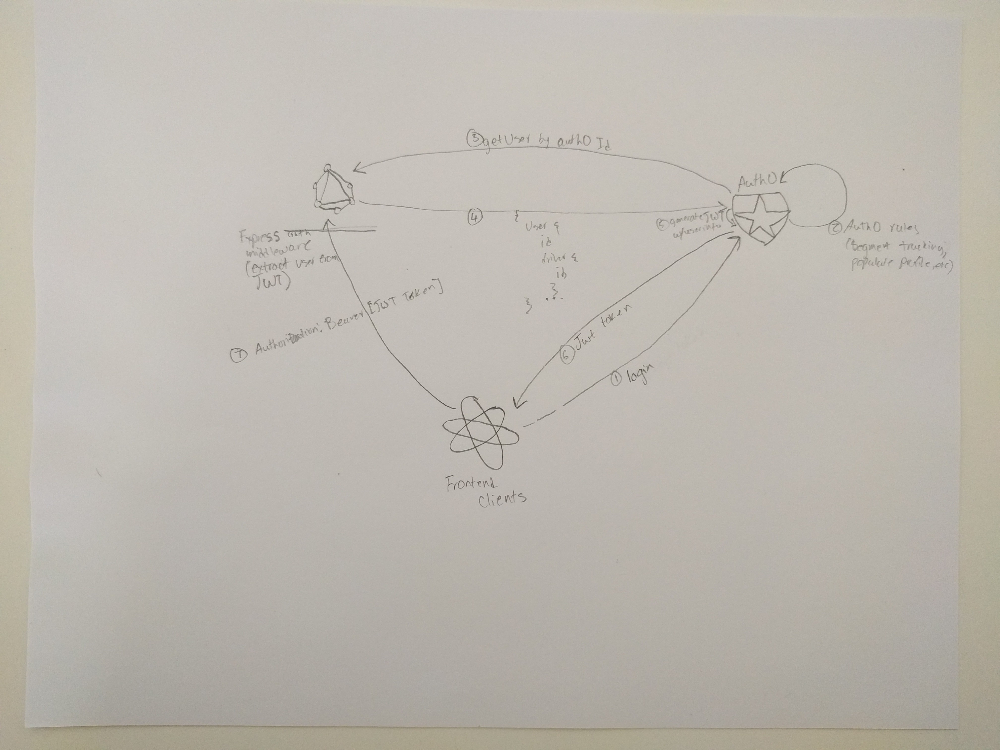

# Authentication \(Auth0\)



## Auth0

Auth0 is primarily responsible for our security. It authenticates the users and issues the JWT tokens for our frontend clients to make authenticated requests to our APIs.

### Rules

We use Auth0 rules which are deployed via the Gitlab plugin on Auth0. The plugin syncs any changes in gitlab to the staging and production branches to their respective tenant. We primarily use rules to enrich the customer profile for when they sign up as well as to retrieve basic user data to include as part of the JWT payload.

## Graphql Server

When a request hits our server, a few things happen:

1. The `express-jwt` plugin validates the JWT token sent by our frontend clients and adds a `user` attribute with the token's payload to the express request object.
2. For the Internal API endpoint, we can receive two types of tokens \(machine-to-machine or normal user\). In either case, the next express middleware checks the scopes or user roles to make sure they have the appropriate permissions.
3. The final middleware on both of the server types will use the `user` attribute exposed from step 1:
   * If user details are included in the payload, it exposes that as the `currentUser`.
   * If no user data is in the payload, it will retrieve the user from our database by their Auth0 userId \(which we store as part of the user table\) or email address and returns that as the `currentUser`.
   * If no such user exists, then it is a new user. We fetch additional user details directly from Auth0 \(which has their enriched profile data\) and add them to our database and return the newly created user as `currentUser`.

Once the above steps are completed, the request will hit the graphql api code. The `getContext` method will receive the express request with the pre-populated `currentUser` attribute and injects it into the graphql context to be used throughout the schema.

