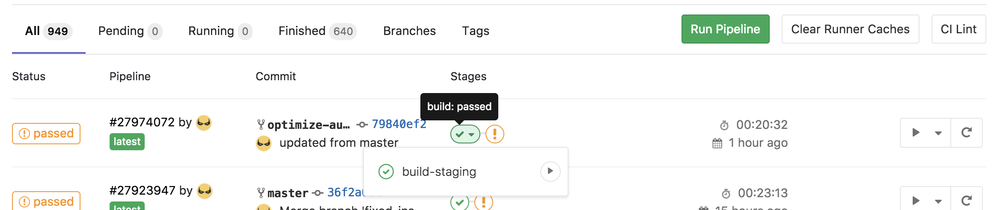
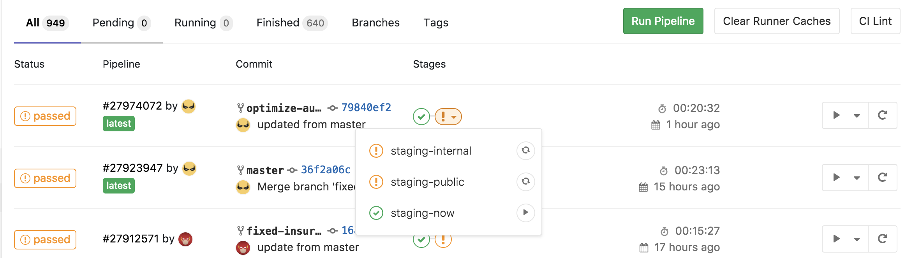

# CI/CD

## Overview

We use gitlab CI to manage the deployment of the server. There are two main steps that take place:

1. Build the docker images and push them to AWS ECR
2. Deploy the services to AWS Elastic Beanstalk as well as zeit now.sh

The servers deployed to Elastic Beanstalk are what are available for the frontend apps via [https://api.hyrecar.com](https://api.hyrecar.com) and [https://internal-api.hyrecar.com](https://internal-api.hyrecar.com).

### Deployment Steps

I will show the steps for deploying the staging server. We follow the same steps for the production server, but it will only be available on the master branch.

### Step 1.1: Build

### Step 1.2: Deploy now.sh

### Step 2: Deploy to internal and public servers

