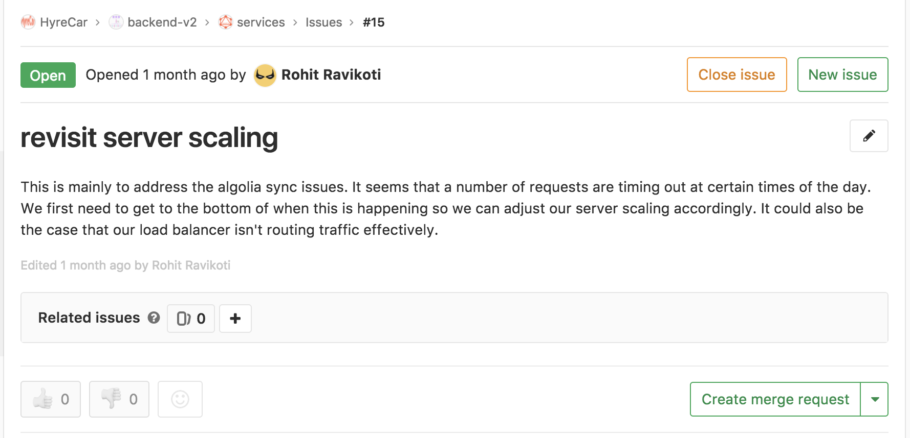

# Protocol

Our protocol is inspired by the github flow process. Here is an overview of what it is:




Our new protocol is still in the early stages and is subject to modification. We will update this documentation as we iterate.


## Step 1: Create a branch

When you're working on a project, you're going to have a bunch of different features or ideas in progress at any given time – some of which are ready to go, and others which are not. Branching exists to help you manage this workflow.

When you create a branch in your project, you're creating an environment where you can try out new ideas. Changes you make on a branch don't affect the `master` branch, so you're free to experiment and commit changes, safe in the knowledge that your branch won't be merged until it's ready to be reviewed by someone you're collaborating with.

### **ProTip**

Branching is a core concept in Git, and the entire GitHub Flow is based upon it. There's only one rule: anything in the `master` branch is always deployable.

Because of this, it's extremely important that your new branch is created off of master when working on a feature or a fix. Your branch name should be descriptive \(e.g., `refactor-authentication`, `user-content-cache-key`, `make-retina-avatars`\), so that others can see what is being worked on.

If there is already an issue in GitLab for the feature you are working on like this:

You can click the "Create merge request" button and it will automatically create a branch and merge request and link them to the issue.  

## Step 2: Add commits

Once your branch has been created, it's time to start making changes. Whenever you add, edit, or delete a file, you're making a commit, and adding them to your branch. This process of adding commits keeps track of your progress as you work on a feature branch.

Commits also create a transparent history of your work that others can follow to understand what you've done and why. Each commit has an associated commit message, which is a description explaining why a particular change was made. Furthermore, each commit is considered a separate unit of change. This lets you roll back changes if a bug is found, or if you decide to head in a different direction.

### **ProTip**

Commit messages are important, especially since Git tracks your changes and then displays them as commits once they're pushed to the server. By writing clear commit messages, you can make it easier for other people to follow along and provide feedback.  

## Step 3: Create a Merge Request

Merge Requests initiate discussion about your commits. Because they're tightly integrated with the underlying Git repository, anyone can see exactly what changes would be merged if they accept your request.

You can open a Merge Request at any point during the development process: when you have little or no code but want to share some screenshots or general ideas, when you're stuck and need help or advice, or when you're ready for someone to review your work. By using GitLab's @mention system in your Merge Request message, you can ask for feedback from specific people or teams, whether they're down the hall or ten time zones away.

## Step 4: Discuss and review your code

Once a Merge Request has been opened, the person or team reviewing your changes may have questions or comments. Perhaps the coding style doesn't match project guidelines, the change is missing unit tests, or maybe everything looks great and props are in order. Merge Requests are designed to encourage and capture this type of conversation.

You can also continue to push to your branch in light of discussion and feedback about your commits. If someone comments that you forgot to do something or if there is a bug in the code, you can fix it in your branch and push up the change. GitLab will show your new commits and any additional feedback you may receive in the unified Merge Request view.

**ProTip**

Merge Request comments are written in Markdown, so you can embed images and emoji, use pre-formatted text blocks, and other lightweight formatting.

## Step 5: Deploy and test

With GitLab, you can deploy from your branch for testing in staging before merging to master.

Once your merge request has been reviewed and the branch passes your tests, you can deploy your changes to verify them in staging. If your branch causes issues, you can roll it back by deploying the existing master into staging.


Since we share the staging environment, it is very important that we communicate when we are about the deploy our branch. 

Before we deploy or test a new feature to the staging branch, we must let each other know in the "[deployments](https://hyre.slack.com/messages/CBVF0C49E)" slack channel. This keeps everyone in the loop and make sure we are not interrupting someone else's deployment.


## Step 6: Merge

Now that your changes have been verified in staging, it is time to merge your code into the master branch and deploy to production.

Once merged, Merge Requests preserve a record of the historical changes to your code. Because they're searchable, they let anyone go back in time to understand why and how a decision was made.

### **ProTip**

By incorporating certain keywords into the text of your Merge Request, you can associate issues with code. When your Pull Request is merged, the related issues are also closed. For example, entering the phrase `Closes #32` would close issue number 32 in the repository.

  

